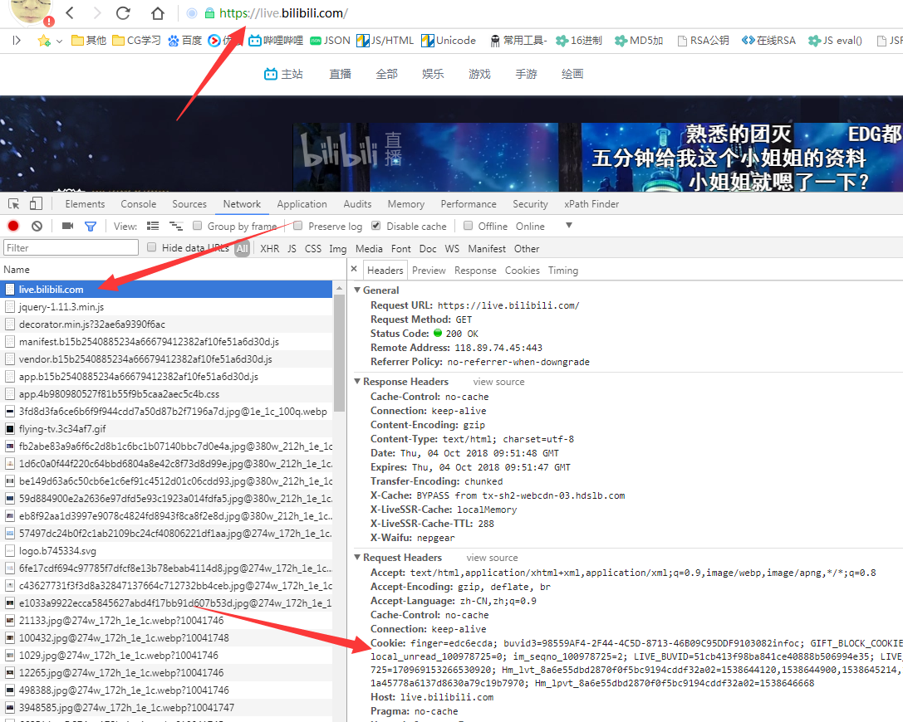
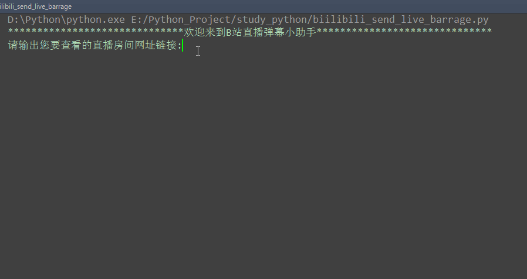

基于[ShengjieZhu/MachineLearning\-HW\-2: 纸牌24点python自动算法](https://github.com/ShengjieZhu/MachineLearning-HW-2)和[Henryhaohao/Bilibili\_Live\_Barrage: Bilibili\_Live\_Barrage实时监控B站直播弹幕并发送跟随弹幕](https://github.com/Henryhaohao/Bilibili_Live_Barrage)糅合的快速计算24点发送弹幕, 用于[弹幕玩24点、算24点或其它点数 \- geniusice18 \- 哔哩哔哩直播，二次元弹幕直播平台](https://live.bilibili.com/23058701)跟使用了脚本还说没用的人打擂台用...

没做OCR识别暂时.

以下为原文

-------


实时监控B站直播弹幕并发送跟随弹幕 
===========================
  
### Bilibili直播官网 - https://live.bilibili.com/

|Author|:sunglasses:Henryhaohao:sunglasses:|
|---|---
|Email|:hearts:1073064953@qq.com:hearts:

    
****
## :dolphin:声明
### 软件均仅用于学习交流，请勿用于任何商业用途！感谢大家！
## :dolphin:介绍
### 该项目为Python实时爬取[B站直播](https://live.bilibili.com/)弹幕并发送跟随弹幕
- 项目介绍:通过传入用户登录B站后得到的Cookie(可以登录后抓包获取)，即可实现监控B站直播弹幕并发送跟随弹幕
- 运行方式:运行Spiders目录下bilibili_live_barrage.py文件即可
## :dolphin:运行环境
Version: Python3
## :dolphin:安装依赖库
```
pip3 install -r requirements.txt
```
## :dolphin:运行截图
> - **如何获取登录后的Cookie值**<br><br>


> - **运行过程**<br><br>

## :dolphin:**总结**
> **最后，如果你觉得这个项目不错或者对你有帮助，给个Star呗，也算是对我学习路上的一种鼓励！<br>
 哈哈哈，感谢大家！笔芯~**:cupid::cupid:


