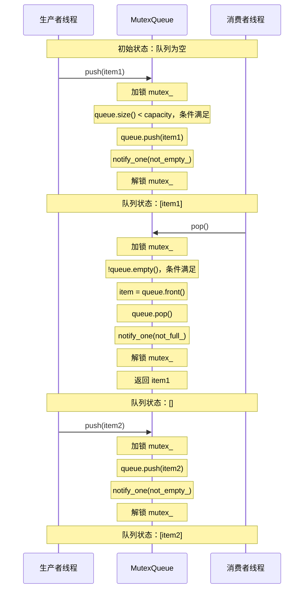
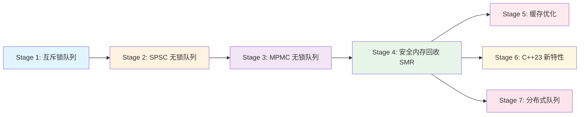

# Stage 1: 互斥锁与条件变量原理

## 概述

本阶段讲解基于互斥锁 (mutex) 和条件变量 (condition variable) 的生产者 - 消费者队列实现。这是理解并发编程的基础，也是后续学习无锁队列的前提。

## 1. 互斥锁 (Mutex) 原理

### 1.1 什么是互斥锁

互斥锁 (Mutual Exclusion Lock) 是一种用于多线程同步的机制，确保同一时刻只有一个线程可以访问共享资源。

**核心特性：**

- **原子性**：加锁和解锁操作是原子的，不可中断
- **排他性**：持有锁的线程独占共享资源
- **阻塞性**：其他线程尝试获取已被占用的锁时会被阻塞

### 1.2 互斥锁的工作原理

```
┌─────────────┐     尝试加锁      ┌─────────────┐
│   Thread A  │ ────────────────► │   Mutex     │
│             │                   │  (unlocked) │
└─────────────┘                   └─────────────┘
                                        │
                                        ▼ 加锁成功
                                  ┌─────────────┐
                                  │   Mutex     │
                                  │  (locked)   │
                                  └─────────────┘
                                        │
                        ┌───────────────┼───────────────┐
                        ▼               ▼               ▼
                  ┌─────────────┐ ┌─────────────┐ ┌─────────────┐
                  │   Thread B  │ │   Thread C  │ │   Thread D  │
                  │   (blocked) │ │   (blocked) │ │   (blocked) │
                  └─────────────┘ └─────────────┘ └─────────────┘
```

### 1.3 C++ std::mutex 使用示例

```cpp
#include <mutex>
#include <queue>

std::mutex mtx;
std::queue<int> shared_queue;

void producer() {
    mtx.lock();           // 加锁
    shared_queue.push(1);
    mtx.unlock();         // 解锁
}

void consumer() {
    mtx.lock();           // 加锁
    if (!shared_queue.empty()) {
        int val = shared_queue.front();
        shared_queue.pop();
    }
    mtx.unlock();         // 解锁
}

// 推荐使用 RAII 方式的 std::lock_guard
void safe_producer() {
    std::lock_guard<std::mutex> lock(mtx);  // 自动加锁，析构时自动解锁
    shared_queue.push(1);
}  // lock 析构，自动解锁
```

## 2. 条件变量 (Condition Variable) 原理

### 2.1 为什么需要条件变量

仅有互斥锁无法高效解决**等待条件满足**的问题。例如：

- 消费者需要等待队列非空才能消费
- 生产者需要等待队列不满才能生产

**轮询方式 (低效)：**

```cpp
void inefficient_consumer() {
    while (true) {
        mtx.lock();
        if (!queue.empty()) {
            auto item = queue.front();
            queue.pop();
            mtx.unlock();
            return item;
        }
        mtx.unlock();
        // 忙等：浪费 CPU 资源
    }
}
```

**条件变量方式 (高效)：**

- 线程可以在条件不满足时**挂起**，不占用 CPU
- 当条件满足时，由其他线程**唤醒**

### 2.2 条件变量的 wait/signal 机制

```cpp
std::condition_variable cv;
std::mutex mtx;
std::queue<int> queue;

// 消费者：等待条件
void consumer() {
    std::unique_lock<std::mutex> lock(mtx);
    cv.wait(lock, []{ return !queue.empty(); });  // 等待队列非空
    auto item = queue.front();
    queue.pop();
}

// 生产者：发送信号
void producer() {
    {
        std::lock_guard<std::mutex> lock(mtx);
        queue.push(42);
    }
    cv.notify_one();  // 唤醒一个等待的消费者
}
```

### 2.3 wait() 的原子性保证

`cv.wait(lock)` 执行原子操作：

1. 释放锁
2. 挂起线程
3. 被唤醒后重新获取锁

```
┌─────────────────────────────────────────────────────────┐
│                   cv.wait(lock)                         │
├─────────────────────────────────────────────────────────┤
│  Step 1: 释放锁 ──────► 其他线程可以获取锁              │
│  Step 2: 挂起线程 ────► 进入等待队列，不占用 CPU        │
│  Step 3: 被唤醒 ──────► 收到 notify 信号                │
│  Step 4: 重新获取锁 ──► 继续执行                        │
└─────────────────────────────────────────────────────────┘
```

### 2.4 为什么使用谓词 (predicate)

```cpp
// 推荐方式：带谓词的 wait
cv.wait(lock, []{ return !queue.empty(); });

// 等价于以下手动循环：
while (queue.empty()) {
    cv.wait(lock);
}
```

**使用谓词的原因：**

1. **虚假唤醒 (Spurious Wakeup)**：线程可能在没有收到 notify 的情况下被唤醒
2. **条件变化**：唤醒后条件可能再次改变

## 3. 生产者 - 消费者模式完整实现

### 3.1 队列实现

参考代码：`[/root/Algorithm_code/simulate_producer_consumer/src/stage1_basic/mutex_queue.hpp](../../src/stage1_basic/mutex_queue.hpp)`

```cpp
template<typename T>
class MutexQueue {
private:
    std::queue<T> queue_;
    mutable std::mutex mutex_;
    std::condition_variable not_empty_;  // 队列非空条件
    std::condition_variable not_full_;   // 队列不满条件
    size_t capacity_;

public:
    explicit MutexQueue(size_t capacity) : capacity_(capacity) {}

    void push(const T& item) {
        std::unique_lock<std::mutex> lock(mutex_);
        // 等待队列不满
        not_full_.wait(lock, [this]{ return queue_.size() < capacity_; });

        queue_.push(item);

        // 通知消费者：队列非空
        not_empty_.notify_one();
    }

    T pop() {
        std::unique_lock<std::mutex> lock(mutex_);
        // 等待队列非空
        not_empty_.wait(lock, [this]{ return !queue_.empty(); });

        T item = queue_.front();
        queue_.pop();

        // 通知生产者：队列不满
        not_full_.notify_one();

        return item;
    }
};
```

### 3.2 生产者 - 消费者时序图




## 4. 性能特点

### 4.1 优点

- **简单易用**：API 清晰，不易出错
- **正确性保证**：硬件级原子操作保证线程安全
- **适用性广**：适用于大多数并发场景

### 4.2 缺点

- **上下文切换开销**：线程阻塞/唤醒涉及系统调用
- **锁竞争**：多线程竞争锁时性能下降
- **优先级反转**：低优先级线程持有锁可能阻塞高优先级线程

### 4.3 适用场景

- 对性能要求不极端的场景
- 需要快速开发的场景
- 作为无锁队列的正确性参照

## 5. 后续学习路径




## 6. 关键要点总结


| 概念                      | 作用       | 注意事项                             |
| ----------------------- | -------- | -------------------------------- |
| std::mutex              | 保护共享资源   | 使用 RAII (lock_guard/unique_lock) |
| std::condition_variable | 线程间条件通知  | 必须与 mutex 配合使用                   |
| wait()                  | 等待条件满足   | 始终使用谓词避免虚假唤醒                     |
| notify_one()            | 唤醒一个等待线程 | 适用于单消费者                          |
| notify_all()            | 唤醒所有等待线程 | 适用于多消费者或广播场景                     |


## 参考资源

- 代码实现：`src/stage1_basic/mutex_queue.hpp`
- 测试用例：`tests/unit/test_mutex_queue.cpp`
- 基准测试：`benchmarks/queue_benchmark.cpp`

