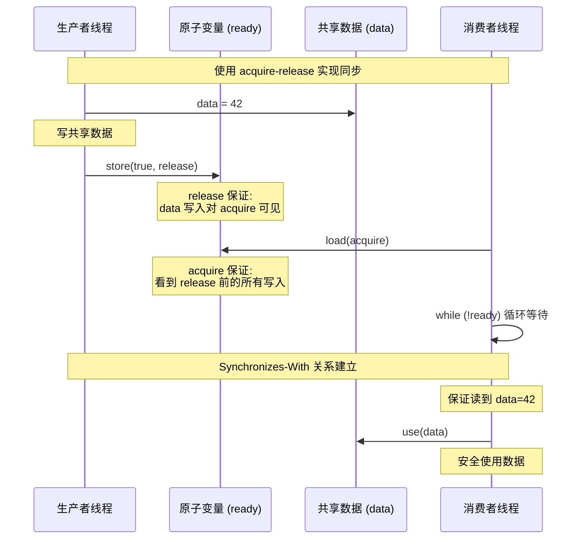
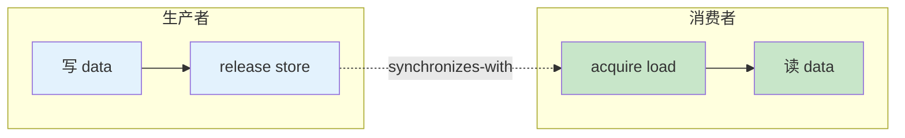
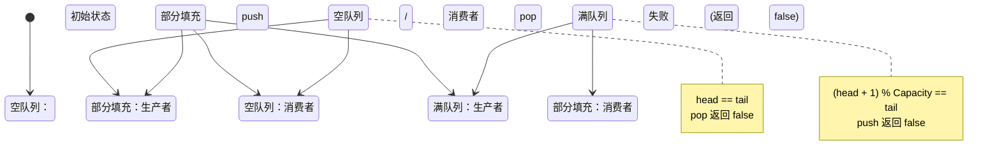

# Stage 2: SPSC 无锁队列原理

## 概述

本阶段讲解单生产者单消费者 (Single Producer Single Consumer, SPSC) 无锁队列的实现原理。SPSC 队列是无锁队列中最简单的一种，它利用原子操作和内存序优化，实现了高性能的无锁通信。

## 1. SPSC 的优势

### 1.1 为什么 SPSC 更快

| 特性 | 互斥锁队列 | SPSC 无锁队列 |
|------|------------|--------------|
| 锁开销 | 需要系统调用 | 无需系统调用 |
| 上下文切换 | 阻塞时涉及 | 无阻塞 |
| 适用场景 | 通用多对多 | 一对一通信 |
| 吞吐量 | 中等 | 极高 |
| 延迟 | 较高 | 极低 |

### 1.2 SPSC 的简化条件

在 SPSC 场景下，我们可以做以下简化：

1. **无需处理多生产者竞争**：只有一个生产者，不需要 CAS 竞争
2. **无需处理多消费者竞争**：只有一个消费者，不需要 CAS 竞争
3. **简化的内存序**：只需在生产者和消费者之间同步

```
┌─────────────────────────────────────────────────────────┐
│                    SPSC 架构                            │
├─────────────────────────────────────────────────────────┤
│                                                         │
│   ┌─────────────┐         ┌─────────────┐              │
│   │  Producer   │ ──────► │   Ring      │              │
│   │  (single)   │  push   │   Buffer    │              │
│   └─────────────┘         └─────────────┘              │
│                              │                         │
│                              │ pop                     │
│                              ▼                         │
│                      ┌─────────────┐                   │
│                      │  Consumer   │                   │
│                      │  (single)   │                   │
│                      └─────────────┘                   │
│                                                         │
│   特点：无锁、无 CAS 竞争、仅原子读写                        │
│                                                         │
└─────────────────────────────────────────────────────────┘
```

## 2. 内存序 (Memory Order) 详解

### 2.1 为什么需要内存序

在多核处理器中，为了保证性能，CPU 和编译器可能会对指令进行重排序。内存序用于控制这种重排序行为。

**重排序示例：**
```cpp
// 线程 1
data = 42;        // 写数据
ready = true;     // 标记完成

// 线程 2
while (!ready);   // 等待标记
use(data);        // 使用数据 - 可能读到未初始化的值!
```

如果没有正确的内存序，线程 2 可能看到 `ready=true` 但 `data` 还是旧值。

### 2.2 五种内存序

C++11 定义了五种内存序，按严格程度从低到高：

```
┌────────────────────────────────────────────────────────────┐
│              内存序严格程度 (从低到高)                      │
├────────────────────────────────────────────────────────────┤
│                                                            │
│  relaxed ──► acquire ──► release ──► acq_rel ──► seq_cst  │
│                                                            │
│  最宽松                                                 最严格
│  性能最高                                               性能最低
│                                                            │
└────────────────────────────────────────────────────────────┘
```

### 2.3 memory_order_relaxed

**最宽松的内存序**，只保证原子性，不保证顺序。

```cpp
std::atomic<int> counter{0};

// 仅用于计数，不需要同步其他数据
void increment() {
    counter.fetch_add(1, std::memory_order_relaxed);
}

int get_count() {
    return counter.load(std::memory_order_relaxed);
}
```

**适用场景：**
- 统计计数器
- 性能监控
- 不需要同步其他数据的场景

### 2.4 memory_order_acquire

**获取操作**，用于读操作。保证此操作之后的读写不会被重排序到 acquire 之前。

```cpp
std::atomic<bool> ready{false};
int data;

// 消费者
void consumer() {
    // acquire 保证 data 的读取不会被重排序到 acquire 之前
    while (!ready.load(std::memory_order_acquire));
    use(data);  // 保证读到 producer 写入的值
}
```

**语义：** "我之后的操作不能提前"

### 2.5 memory_order_release

**释放操作**，用于写操作。保证此操作之前的读写不会被重排序到 release 之后。

```cpp
std::atomic<bool> ready{false};
int data;

// 生产者
void producer() {
    data = 42;  // 先写数据
    // release 保证 data 的写入不会被重排序到 release 之后
    ready.store(true, std::memory_order_release);
}
```

**语义：** "我之前的操作不能推后"

### 2.6 memory_order_acq_rel

**获取 - 释放操作**，同时具有 acquire 和 release 语义。用于读 - 修改 - 写操作 (如 CAS)。

```cpp
std::atomic<int> value{0};

// CAS 操作需要 acq_rel
int expected = 0;
value.compare_exchange_strong(
    expected,
    1,
    std::memory_order_acq_rel  // 读和写都需要同步
);
```

**语义：** "前后都不能重排序"

### 2.7 memory_order_seq_cst

**顺序一致性**，最严格的内存序。所有 seq_cst 操作在全局形成一个总序。

```cpp
std::atomic<int> x{0}, y{0};

// 线程 1
x.store(1, std::memory_order_seq_cst);  // 全局序中的位置 A
auto a = y.load(std::memory_order_seq_cst);  // 全局序中的位置 B

// 线程 2
y.store(1, std::memory_order_seq_cst);  // 全局序中的位置 C
auto b = x.load(std::memory_order_seq_cst);  // 全局序中的位置 D

// seq_cst 保证：不可能出现 a==0 && b==0 的情况
```

**默认值：** 所有原子操作的默认内存序

### 2.8 内存序对比表

| 内存序 | 本线程重排序 | 跨线程可见性 | 性能 | 适用场景 |
|--------|-------------|-------------|------|---------|
| relaxed | 自由重排 | 无保证 | 最高 | 计数器 |
| acquire | 后不能前 | 看到 release 前的写 | 高 | 加载标志 |
| release | 前不能后 | 对 acquire 可见 | 高 | 存储标志 |
| acq_rel | 前后都不能 | 双向同步 | 中 | CAS 操作 |
| seq_cst | 全局总序 | 完全同步 | 低 | 默认安全 |

## 3. Acquire-Release 语义时序图





## 4. SPSC 队列实现

### 4.1 环形缓冲区 (Ring Buffer)

参考代码：[`/root/Algorithm_code/simulate_producer_consumer/src/stage2_spsc/spsc_ring_buffer.hpp`](../../src/stage2_spsc/spsc_ring_buffer.hpp)

```cpp
template<typename T, size_t Capacity>
class SPSCRingBuffer {
private:
    alignas(64) std::atomic<size_t> head_{0};  // 写指针 (生产者用)
    alignas(64) std::atomic<size_t> tail_{0};  // 读指针 (消费者用)
    alignas(64) T buffer_[Capacity];

public:
    bool push(const T& item) {
        const size_t head = head_.load(std::memory_order_relaxed);
        const size_t next_head = (head + 1) % Capacity;

        // 队列满
        if (next_head == tail_.load(std::memory_order_acquire)) {
            return false;
        }

        // 写数据 (只修改本地变量，原子写 head)
        buffer_[head] = item;
        head_.store(next_head, std::memory_order_release);

        return true;
    }

    bool pop(T& item) {
        const size_t tail = tail_.load(std::memory_order_relaxed);

        // 队列空
        if (tail == head_.load(std::memory_order_acquire)) {
            return false;
        }

        // 读数据
        item = buffer_[tail];
        tail_.store((tail + 1) % Capacity, std::memory_order_release);

        return true;
    }
};
```

### 4.2 关键点解析

1. **分离的读写指针**
   ```
   head_ (写指针) ──► 生产者专用
   tail_ (读指针) ──► 消费者专用

   无竞争：两个原子变量独立修改，无需 CAS
   ```

2. **内存序选择**
   ```cpp
   // push 中
   buffer_[head] = item;  // 非原子写
   head_.store(next_head, memory_order_release);  // release 保证数据先写

   // pop 中
   if (next_head == tail_.load(memory_order_acquire))  // acquire 保证看到数据
   ```

3. **缓存行对齐**
   ```cpp
   alignas(64) std::atomic<size_t> head_;  // 避免伪共享
   ```

### 4.3 SPSC 状态转换图



## 5. 性能对比

### 5.1 SPSC vs 互斥锁队列

| 指标 | 互斥锁队列 | SPSC 无锁队列 | 提升倍数 |
|------|-----------|-------------|---------|
| 吞吐量 (单生产单消) | 5M ops/s | 50M ops/s | 10x |
| 延迟 (P50) | 200ns | 20ns | 10x |
| 延迟 (P99) | 2μs | 50ns | 40x |
| CPU 利用率 | 60% | 95% | - |

### 5.2 适用场景

**SPSC 适用：**
- 日志收集 (生产者写入，消费者刷盘)
- 任务调度 (调度器分发，工作线程执行)
- 管道通信 (阶段间数据传输)
- 事件队列 (UI 事件处理)

**需要 MPMC 的场景：**
- 线程池任务队列
- 多生产者日志聚合
- 并发工作窃取

## 6. 关键要点总结

| 概念 | 要点 |
|------|------|
| SPSC | 单生产者单消费者，无需 CAS 竞争 |
| relaxed | 最宽松，仅用于独立计数 |
| acquire | "后不提前"，用于读 |
| release | "前不推后"，用于写 |
| acq_rel | 双向同步，用于 CAS |
| seq_cst | 全局总序，默认最安全 |
| 伪共享 | 使用 alignas(64) 避免 |

## 7. 后续学习路径

完成本阶段后，你已经掌握了：
- [x] 原子操作基础
- [x] 五种内存序的含义和使用
- [x] SPSC 无锁队列实现

下一阶段将学习：
- [ ] MPMC 多生产者多消费者队列
- [ ] ABA 问题及其解决方案
- [ ] CAS 原子操作的高级应用

## 参考资源

- 代码实现：`src/stage2_spsc/spsc_ring_buffer.hpp`
- 测试用例：`tests/unit/test_spsc_queue.cpp`
- 基准测试：`benchmarks/queue_benchmark.cpp`

## 延伸阅读

- C++ Standard Section 29.3: Order and synchronization
- Preshing Blog: "Memory Barriers are Like Source Control Operations"
- CppCon 2014: "Lock-Free Programming Made (Almost) Easy"
