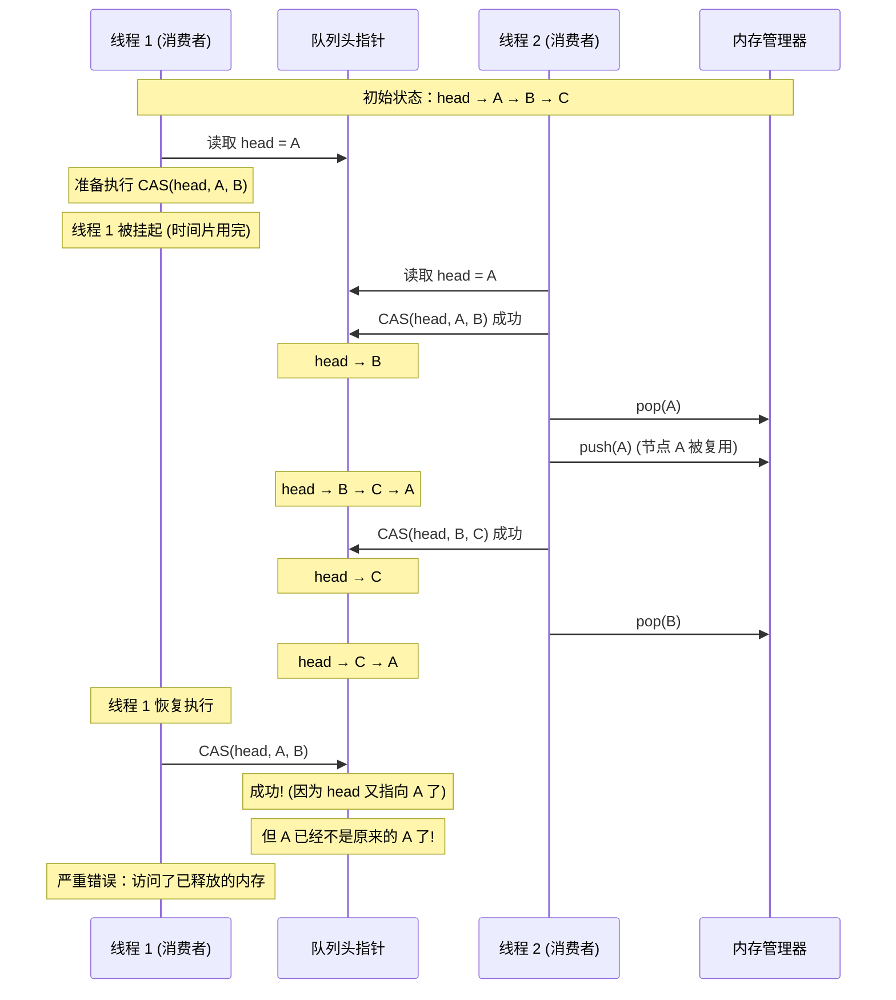

# Stage 3: MPMC 队列与 ABA 问题

## 概述

本阶段讲解多生产者多消费者 (Multiple Producer Multiple Consumer, MPMC) 无锁队列的实现，以及无锁编程中经典的 ABA 问题及其解决方案。

## 1. MPMC 的挑战

### 1.1 从 SPSC 到 MPMC

SPSC 队列之所以高效，是因为：
- 生产者和消费者各自独占一个原子变量
- 无需 CAS 竞争

MPMC 队列面临新的挑战：
- **多生产者竞争**：多个生产者同时修改 head 指针
- **多消费者竞争**：多个消费者同时修改 tail 指针
- **需要 CAS 操作**：使用 compare_exchange 保证原子性

```
┌─────────────────────────────────────────────────────────┐
│                    MPMC 架构                            │
├─────────────────────────────────────────────────────────┤
│                                                         │
│   ┌─────────┐    ┌─────────┐                           │
│   │  P1     │    │  P2     │                           │
│   └────┬────┘    └────┬────┘                           │
│        │             │            ┌─────────────┐      │
│        └──────┬──────┴───────────►│   MPMC      │      │
│               │                  │   Queue     │      │
│        ┌──────┴──────┬───────────┤             │      │
│        │             │           └──────┬──────┘      │
│   ┌────┴────┐    ┌────┴────┐           │             │
│   │  C1     │    │  C2     │◄──────────┘             │
│   └─────────┘    └─────────┘                           │
│                                                         │
│   挑战：                                                │
│   - 多个生产者竞争 head 指针 (需要 CAS)                  │
│   - 多个消费者竞争 tail 指针 (需要 CAS)                  │
│   - ABA 问题可能出现                                     │
│                                                         │
└─────────────────────────────────────────────────────────┘
```

### 1.2 CAS 操作 (Compare-And-Swap)

```cpp
template<typename T>
bool atomic_compare_exchange(
    std::atomic<T>* obj,
    T* expected,      // 期望值
    T desired,        // 新值
    std::memory_order success,
    std::memory_order failure
) {
    // 原子操作：如果 *obj == *expected，则 *obj = desired
    // 返回 true 表示成功，false 表示失败
    // 无论成功失败，*expected 都会被更新为 *obj 的实际值
}

// C++ 简化用法
std::atomic<int> value{10};
int expected = 10;
bool success = value.compare_exchange_strong(expected, 20);
// success = true, value = 20

expected = 10;  // 如果之前失败了，expected 已被更新
success = value.compare_exchange_strong(expected, 30);
// success = false (value 已经是 20), expected = 20
```

### 1.3 MPMC 队列基础实现

```cpp
template<typename T, size_t Capacity>
class MPMCQueue {
private:
    struct Cell {
        std::atomic<size_t> sequence;
        T data;
    };

    alignas(64) std::atomic<size_t> head_{0};
    alignas(64) std::atomic<size_t> tail_{0};
    Cell buffer_[Capacity];

public:
    MPMCQueue() {
        for (size_t i = 0; i < Capacity; ++i) {
            buffer_[i].sequence.store(i, std::memory_order_relaxed);
        }
    }

    bool push(const T& item) {
        size_t pos;
        Cell* cell;

        while (true) {
            pos = head_.load(std::memory_order_relaxed);
            cell = &buffer_[pos % Capacity];
            size_t seq = cell->sequence.load(std::memory_order_acquire);
            intptr_t diff = (intptr_t)seq - (intptr_t)pos;

            if (diff == 0) {
                // 位置可用，尝试 CAS 抢占
                if (head_.compare_exchange_weak(pos, pos + 1,
                        std::memory_order_relaxed)) {
                    break;
                }
            } else if (diff < 0) {
                // 队列满
                return false;
            }
            // 否则重试
        }

        cell->data = item;
        cell->sequence.store(pos + 1, std::memory_order_release);
        return true;
    }

    bool pop(T& item) {
        size_t pos;
        Cell* cell;

        while (true) {
            pos = tail_.load(std::memory_order_relaxed);
            cell = &buffer_[pos % Capacity];
            size_t seq = cell->sequence.load(std::memory_order_acquire);
            intptr_t diff = (intptr_t)seq - (intptr_t)(pos + 1);

            if (diff == 0) {
                // 有数据，尝试 CAS 抢占
                if (tail_.compare_exchange_weak(pos, pos + 1,
                        std::memory_order_relaxed)) {
                    break;
                }
            } else if (diff < 0) {
                // 队列空
                return false;
            }
            // 否则重试
        }

        item = cell->data;
        cell->sequence.store(pos + Capacity, std::memory_order_release);
        return true;
    }
};
```

## 2. ABA 问题详解

### 2.1 什么是 ABA 问题

ABA 问题是无锁编程中的经典陷阱，发生在使用 CAS 操作时。

**问题场景：**
```
线程 1 执行 CAS 操作的步骤：
1. 读取值 A
2. 进行一些计算
3. CAS: 如果值仍然是 A，则改为 B

问题：在步骤 1 和 3 之间，值可能经历了 A→B→A 的变化！
     CAS 会成功，但状态已经不同了！
```

### 2.2 ABA 问题形成过程

让我们用队列中的节点复用场景来说明：



### 2.3 ABA 问题图解

```
初始状态:
head ──► [A: data=1] ──► [B: data=2] ──► [C: data=3] ──► null

时间线：
t0: 线程 1 读取 head = A，准备 CAS(head, A, B)
t1: 线程 1 被挂起

t2: 线程 2 pop(A) → head = B
t3: 线程 2 pop(B) → head = C
t4: 线程 2 push(D) → 复用了节点 A 的内存！

现在内存布局:
head ──► [C: data=3] ──► [D: data=4] ──► [A: data=5] ──► null
                                   ↑
                                   相同的地址，不同的内容!

t5: 线程 1 恢复，执行 CAS(head, A, B)
    成功！因为 head 确实指向 A (的地址)
    但是：A 的内容已经从 data=1 变成了 data=5
    结果：线程 1 操作了错误的数据！
```

### 2.4 ABA 问题的三种解决方案

## 3. 方案一：标记指针 (Tagged Pointer)

### 3.1 原理

在指针中附加一个版本号 (tag)，每次修改都递增版本号。

```
┌─────────────────────────────────────────┐
│         64 位指针布局 (x86-64)          │
├─────────────────────────────────────────┤
│                                         │
│  高位 16 位    │   低 48 位              │
│  (未使用)    │   (实际地址)             │
│      │       │                          │
│      └──────►├─ 可用于存储 tag ──┤     │
│                                         │
│  实际可用：48 位地址 + 16 位 tag           │
│  48 位地址空间：256 TB (足够用)           │
│                                         │
└─────────────────────────────────────────┘
```

### 3.2 实现代码

```cpp
template<typename T>
class TaggedPtr {
private:
    struct TaggedPtrInternal {
        T* ptr;
        uint16_t tag;  // 版本号
    };

    std::atomic<TaggedPtrInternal> tagged_{nullptr, 0};

public:
    bool compare_exchange_weak(
        TaggedPtrInternal& expected,
        TaggedPtrInternal desired
    ) {
        // 同时比较 ptr 和 tag
        return tagged_.compare_exchange_weak(expected, desired);
    }

    void store(T* ptr, uint16_t new_tag) {
        tagged_.store({ptr, new_tag});
    }

    TaggedPtrInternal load() const {
        return tagged_.load();
    }
};

// 使用示例
template<typename T>
class TaggedPtrStack {
private:
    struct Node {
        T data;
        Node* next;
    };

    std::atomic<uint64_t> head_{0};  // 高 16 位 tag, 低 48 位 ptr

    Node* get_ptr(uint64_t tagged) {
        return reinterpret_cast<Node*>(tagged & 0xFFFFFFFFFFFFULL);
    }

    uint16_t get_tag(uint64_t tagged) {
        return tagged >> 48;
    }

public:
    void push(T data) {
        Node* new_node = new Node{data, nullptr};
        uint64_t old_head = head_.load();

        do {
            new_node->next = get_ptr(old_head);
            uint64_t new_tagged = ((uint64_t)(get_tag(old_head) + 1) << 48)
                                | reinterpret_cast<uint64_t>(new_node);
            if (head_.compare_exchange_weak(old_head, new_tagged)) {
                return;
            }
        } while (true);
    }
};
```

### 3.3 优缺点

| 优点 | 缺点 |
|------|------|
| 无需额外内存开销 | 依赖平台 (需要未使用的高位) |
| 原子操作单变量 | ARM 平台可能不支持 128 位原子 |
| 简单高效 | tag 会回绕 (2^16 次后) |

## 4. 方案二：版本号 (Version Number)

### 4.1 原理

使用 128 位原子操作 (如果支持) 或双字 CAS，将指针和版本号打包。

```cpp
#include <atomic>

template<typename T>
class AtomicVersionedPtr {
private:
    // 128 位结构体
    struct VersionedPtr {
        T* ptr;
        uint64_t version;
    };

    static_assert(sizeof(VersionedPtr) == 16,
                  "VersionedPtr must be 128 bits");

    std::atomic<VersionedPtr> vp_;

public:
    bool compare_exchange_weak(
        VersionedPtr& expected,
        VersionedPtr desired
    ) {
        // C++20 支持 128 位原子操作
        return vp_.compare_exchange_weak(expected, desired);
    }
};
```

### 4.2 使用 boost::atomic

```cpp
#include <boost/atomic.hpp>

template<typename T>
class BoostVersionedPtr {
private:
    struct VersionedPtr {
        T* ptr;
        uint64_t version;
    };

    boost::atomic<VersionedPtr> vp_;

public:
    bool cas(VersionedPtr& expected, const VersionedPtr& desired) {
        return vp_.compare_exchange_strong(expected, desired);
    }
};
```

## 5. 方案三：Hazard Pointers

### 5.1 原理

Hazard Pointer 是一种安全的内存回收 (SMR) 机制。

**核心思想：**
- 线程在访问共享节点前，先将指针注册到 hazard pointer 数组
- 其他线程想要回收节点时，先检查是否在 hazard pointer 数组中
- 如果在，则延迟回收；否则可以安全释放

```
┌─────────────────────────────────────────────────────────┐
│              Hazard Pointer 机制                        │
├─────────────────────────────────────────────────────────┤
│                                                         │
│  线程 1:                   线程 2:                       │
│  ┌─────────────┐          ┌─────────────┐              │
│  │ HP[0] = A   │          │ 想要回收 A  │               │
│  │ (正在访问)  │          │             │              │
│  └─────────────┘          └─────────────┘              │
│         │                        │                     │
│         ▼                        ▼                     │
│  ┌─────────────────────────────────────┐              │
│  │     Hazard Pointer 全局数组         │              │
│  │  [HP0: A, HP1: null, HP2: B, ...]   │              │
│  └─────────────────────────────────────┘              │
│         │                        │                     │
│         ▼                        ▼                     │
│  线程 2 检查：A 在 HP 数组中！               │
│         │                        │                     │
│         └──────────┬─────────────┘                     │
│                    ▼                                   │
│         延迟回收，放入待回收列表                        │
│                                                         │
└─────────────────────────────────────────────────────────┘
```

### 5.2 实现代码

参考代码：[`/root/Algorithm_code/simulate_producer_consumer/src/stage3_mpmc/aba_safe_queue.hpp`](../../src/stage3_mpmc/aba_safe_queue.hpp)

```cpp
template<typename T>
class HazardPointerQueue {
private:
    static constexpr size_t MAX_THREADS = 256;

    struct HazardPointer {
        std::atomic<std::intptr_t> hp{0};  // 保护的指针

        bool is_protecting(std::intptr_t ptr) const {
            return hp.load() == ptr;
        }
    };

    static HazardPointer hazard_pointers_[MAX_THREADS];

    struct RetiredNode {
        std::intptr_t ptr;
        std::function<void()> deleter;
    };

    // 每个线程的待回收列表
    static thread_local std::vector<RetiredNode> retired_list_;

    int get_thread_id() {
        static thread_local int tid = -1;
        if (tid == -1) {
            static std::atomic<int> counter{0};
            tid = counter.fetch_add(1);
        }
        return tid;
    }

    bool is_hazardous(std::intptr_t ptr) {
        for (size_t i = 0; i < MAX_THREADS; ++i) {
            if (hazard_pointers_[i].is_protecting(ptr)) {
                return true;
            }
        }
        return false;
    }

    void scan_and_reclaim() {
        std::vector<RetiredNode> still_retired;

        for (auto& node : retired_list_) {
            if (!is_hazardous(node.ptr)) {
                node.deleter();  // 安全释放
            } else {
                still_retired.push_back(node);  // 延迟回收
            }
        }

        retired_list_ = std::move(still_retired);
    }

public:
    class Guard {
    public:
        Guard(int id) : id_(id) {}

        void protect(std::intptr_t ptr) {
            hazard_pointers_[id_].hp.store(ptr);
        }

        void clear() {
            hazard_pointers_[id_].hp.store(0);
        }

        ~Guard() { clear(); }

    private:
        int id_;
    };

    void retire_node(std::intptr_t ptr, std::function<void()> deleter) {
        retired_list_.push_back({ptr, deleter});

        // 阈值触发回收
        if (retired_list_.size() > 100) {
            scan_and_reclaim();
        }
    }
};

// 全局定义
template<typename T>
typename HazardPointerQueue<T>::HazardPointer
    HazardPointerQueue<T>::hazard_pointers_[MAX_THREADS];

template<typename T>
thread_local std::vector<typename HazardPointerQueue<T>::RetiredNode>
    HazardPointerQueue<T>::retired_list_;
```

### 5.3 使用示例

```cpp
void consumer(HazardPointerQueue<int>::Guard& guard) {
    Node* node;

    do {
        node = head_.load();
        guard.protect(reinterpret_cast<std::intptr_t>(node));
        // 双重检查，防止 ABA
        if (node != head_.load()) continue;
    } while (node == nullptr);

    // 安全访问 node->data
    auto value = node->data;

    // CAS 成功后，旧节点需要延迟回收
    if (head_.compare_exchange_weak(node, node->next)) {
        guard.clear();
        retire_node(
            reinterpret_cast<std::intptr_t>(node),
            [node]() { delete node; }
        );
        return value;
    }
}
```

### 5.4 三种方案对比

| 方案 | 内存开销 | 性能 | 复杂度 | 适用场景 |
|------|---------|------|--------|---------|
| 标记指针 | 无 | 高 | 低 | x86-64 平台 |
| 版本号 | 8 字节/节点 | 中 | 中 | 支持 128 位原子平台 |
| Hazard Pointers | O(线程数) | 低 | 高 | 跨平台，通用 SMR |

## 6. 代码链接

### 6.1 MPMC 队列实现

[`src/stage3_mpmc/mpmc_lockfree_queue.hpp`](../../src/stage3_mpmc/mpmc_lockfree_queue.hpp)

```cpp
// 基础 MPMC 队列，使用 sequence 避免 ABA
// 适用于理解 MPMC 基本原理
```

### 6.2 ABA 安全队列实现

[`src/stage3_mpmc/aba_safe_queue.hpp`](../../src/stage3_mpmc/aba_safe_queue.hpp)

```cpp
// 使用 Hazard Pointer 方案解决 ABA 问题
// 跨平台，适用于生产环境
```

## 7. 关键要点总结

| 概念 | 要点 |
|------|------|
| MPMC | 多生产者多消费者，需要 CAS 竞争 |
| CAS | compare_exchange，原子条件更新 |
| ABA 问题 | 值 A→B→A 变化，CAS 无法检测 |
| 标记指针 | 用指针高位存储版本号 |
| Hazard Pointers | 注册保护指针，延迟回收 |
| SMR | 安全内存回收，防止释放使用中内存 |

## 8. 后续学习路径

完成本阶段后，你已经掌握了：
- [x] MPMC 队列实现
- [x] ABA 问题及其三种解决方案
- [x] Hazard Pointer 基本原理

下一阶段将深入学习：
- [ ] Epoch-based Reclamation (另一种 SMR 方案)
- [ ] Hazard Pointer 与 Epoch 的对比
- [ ] 生产环境 SMR 实现

## 参考资源

- 代码实现：
  - `src/stage3_mpmc/mpmc_lockfree_queue.hpp`
  - `src/stage3_mpmc/aba_safe_queue.hpp`
- 测试用例：`tests/unit/test_mpmc_queue.cpp`
- 论文：Hazard Pointers: Safe Memory Reclamation for Lock-Free Objects (Maged Michael, 2004)
