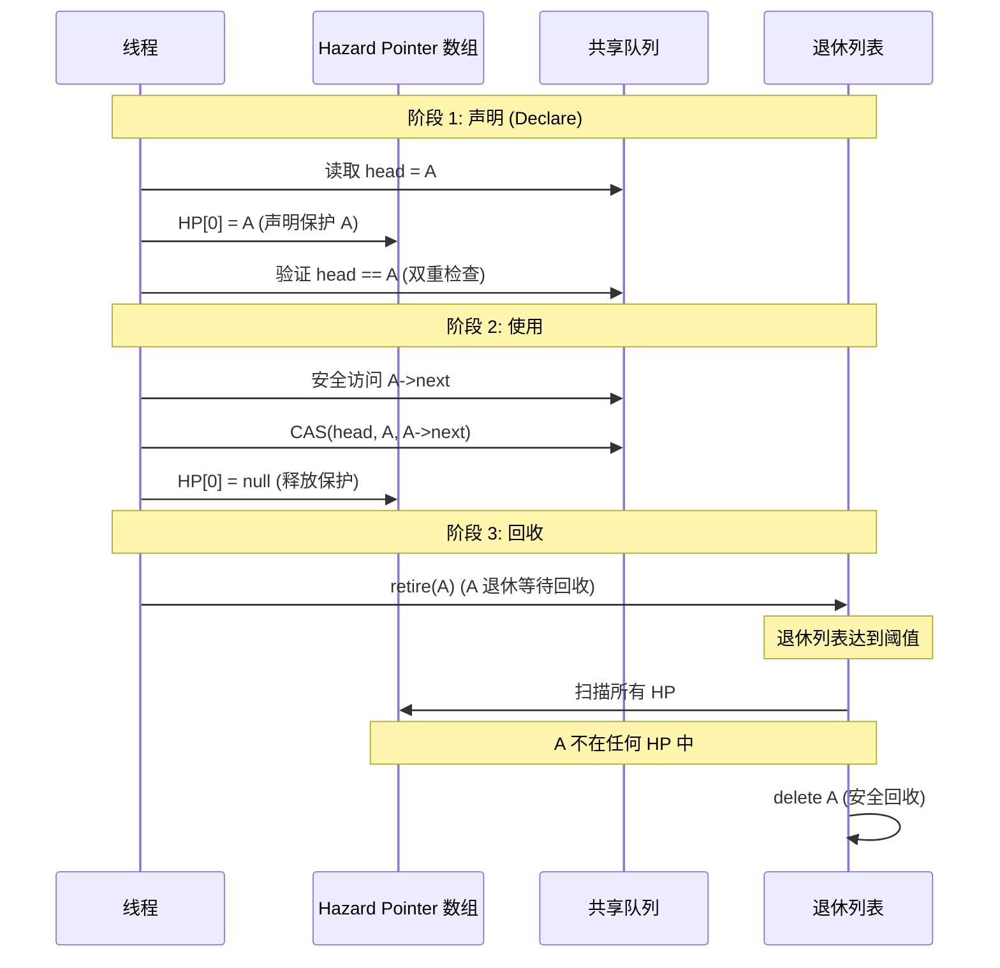
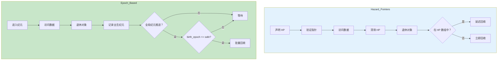
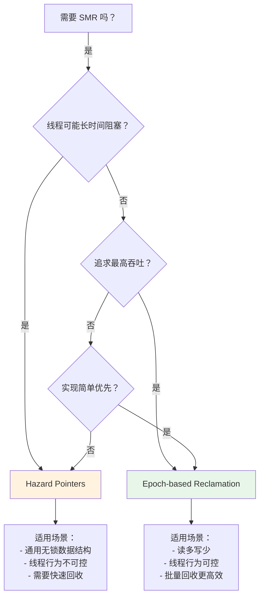

# Stage 4: 安全内存回收 (SMR) 原理

## 概述

本阶段深入讲解安全内存回收 (Safe Memory Reclamation, SMR) 技术。在无锁数据结构中，如何安全地释放内存是一个核心挑战。我们将详细讲解两种主流 SMR 技术：**Hazard Pointers** 和 **Epoch-based Reclamation**。

参考代码：
- [`src/stage4_smr/hazard_pointers.hpp`](../../src/stage4_smr/hazard_pointers.hpp)
- [`src/stage4_smr/epoch_based_reclamation.hpp`](../../src/stage4_smr/epoch_based_reclamation.hpp)

## 1. 为什么需要 SMR

### 1.1 无锁数据结构的内存管理挑战

在锁基数据结构中，内存管理相对简单：

```cpp
// 锁基队列 - 内存管理简单
void pop() {
    std::lock_guard<std::mutex> lock(mutex_);
    Node* old = head_;
    head_ = head_->next;
    delete old;  // 安全：没有其他线程能访问 old
}
```

在无锁数据结构中，问题变得复杂：

```
┌─────────────────────────────────────────────────────────┐
│              无锁队列的内存管理问题                      │
├─────────────────────────────────────────────────────────┤
│                                                         │
│  线程 1:                   线程 2:                       │
│  ┌─────────────┐          ┌─────────────┐              │
│  │ 读取 head=A │          │  CAS(A,B)   │               │
│  └─────────────┘          └─────────────┘              │
│         │                        │                     │
│         │ (被中断/延迟)          │                     │
│         │                        ▼                     │
│         │                 ┌─────────────┐              │
│         │                 │  delete A   │               │
│         │                 │  (安全吗？) │               │
│         ▼                 └─────────────┘              │
│  ┌─────────────┐                                      │
│  │ 访问 A->next│ ◄────── Use After Free!              │
│  └─────────────┘                                      │
│                                                         │
└─────────────────────────────────────────────────────────┘
```

### 1.2 问题根源

在无锁算法中：
1. 线程可能读取共享指针后进入休眠
2. 其他线程可能修改并删除该对象
3. 原线程醒来后访问已释放内存 → **崩溃**

### 1.3 SMR 解决方案

SMR 技术的目标：**确保对象只有在没有线程访问时才能被释放**

两种主流方案：
| 技术 | 提出者 | 年份 | 核心思想 |
|------|--------|------|---------|
| Hazard Pointers | Maged Michael | 2004 | 声明正在访问的指针 |
| Epoch-based | 多种实现 | 2010s | 全局纪元同步 |

## 2. Hazard Pointers (危险指针)

### 2.1 核心思想

每个线程维护一个"危险指针"列表，声明它当前正在访问的内存地址。

```
┌─────────────────────────────────────────────────────────┐
│              Hazard Pointer 机制                        │
├─────────────────────────────────────────────────────────┤
│                                                         │
│  线程 1:                   回收者:                       │
│  ┌─────────────┐          ┌─────────────┐              │
│  │ HP[0] = A   │          │ 想回收 A    │               │
│  │ (保护中)    │          │             │              │
│  └─────────────┘          └─────────────┘              │
│         │                        │                     │
│         ▼                        ▼                     │
│  ┌─────────────────────────────────────┐              │
│  │     全局 Hazard Pointer 数组        │              │
│  │  [HP0: A, HP1: null, HP2: B, ...]   │              │
│  └─────────────────────────────────────┘              │
│         │                        │                     │
│         ▼                        ▼                     │
│  回收者检查：A 在 HP 数组中被保护！       │
│         │                        │                     │
│         └──────────┬─────────────┘                     │
│                    ▼                                   │
│         延迟回收，放入退休列表                          │
│                                                         │
└─────────────────────────────────────────────────────────┘
```

### 2.2 声明、验证、回收流程



### 2.3 实现详解

#### 2.3.1 数据结构

```cpp
template<size_t MAX_HAZARDS_PER_THREAD = 8>
class HazardPointers {
    // 每个线程的危险记录
    struct HazardRecord {
        std::thread::id thread_id;
        std::array<std::atomic<void*>, MAX_HAZARDS_PER_THREAD> hazards;
        std::atomic<bool> active;
    };

    // 全局记录数组
    static std::array<HazardRecord, MAX_THREADS> hazard_records_;

    // 退休列表
    thread_local static std::vector<RetiredNode> retired_list_;
};
```

#### 2.3.2 HazardGuard RAII 类

```cpp
template<typename T>
class HazardGuard {
    std::atomic<void*>* hazard_slot_;

public:
    // 保护一个指针
    T* protect(std::atomic<T*>& ptr) {
        T* current;
        do {
            current = ptr.load(std::memory_order_acquire);
            hazard_slot_->store(current, std::memory_order_release);
            // 双重检查防止 ABA
        } while (current != ptr.load(std::memory_order_acquire));
        return current;
    }

    ~HazardGuard() {
        // 自动清除保护
        hazard_slot_->store(nullptr, std::memory_order_release);
    }
};
```

#### 2.3.3 回收算法

```cpp
static void reclaim_retired_objects() {
    // 1. 收集所有活跃的危险指针
    auto hazards = collect_hazards();

    // 2. 扫描退休列表
    auto it = retired_list_.begin();
    while (it != retired_list_.end()) {
        if (hazards.find(it->ptr) == hazards.end()) {
            // 3. 不被任何 HP 保护，安全删除
            it->deleter(it->ptr);
            it = retired_list_.erase(it);
        } else {
            ++it;  // 仍被保护，延迟回收
        }
    }
}
```

### 2.4 使用示例

```cpp
#include "stage4/hazard_pointers.hpp"

using Queue = stage4::HazardProtectedQueue<int>;

Queue queue;

// 生产者
void producer() {
    for (int i = 0; i < 1000; ++i) {
        queue.enqueue(i);
    }
}

// 消费者
void consumer() {
    int value;
    while (queue.dequeue(value)) {
        // 自动使用 Hazard Pointer 保护
        process(value);
    }
}
```

## 3. Epoch-based Reclamation (纪元回收)

### 3.1 核心思想

系统维护全局纪元计数器，线程进入纪元后才能访问数据，只有当所有线程都离开某纪元时，该纪元的对象才能被回收。

```
┌─────────────────────────────────────────────────────────┐
│           Epoch-based Reclamation 机制                  │
├─────────────────────────────────────────────────────────┤
│                                                         │
│  全局纪元：3                                            │
│                                                         │
│  线程 1: epoch=3  ──┐                                  │
│  线程 2: epoch=3  ──┼──► 可以回收 epoch < 1 的对象      │
│  线程 3: epoch=2  ──┘     (所有线程都离开了 epoch 0,1)   │
│                                                         │
│  待回收列表：                                           │
│  - ptr=0x1000, birth_epoch=0  ✓ 可回收                  │
│  - ptr=0x2000, birth_epoch=1  ✓ 可回收                  │
│  - ptr=0x3000, birth_epoch=2  ✗ 等待 (线程 3 还在 epoch 2) │
│                                                         │
└─────────────────────────────────────────────────────────┘
```

### 3.2 全局纪元、线程状态、回收条件

```mermaid
stateDiagram-v2
    [*] --> 纪元 0: 系统启动

    纪元 0 --> 纪元 1: 所有线程进入 epoch 0
    纪元 1 --> 纪元 2: 所有线程进入 epoch 1
    纪元 2 --> 纪元 3: 所有线程进入 epoch 2

    state 回收条件 {
        [*] --> 检查：读取全局纪元 G
        检查 --> 计算：找到最小线程纪元 M
        计算 --> 判断：M >= G-2 ?
        判断 --> 可回收：是
        判断 --> 等待：否
        可回收 --> [*]: 回收 birth_epoch < G-2 的对象
        等待 --> [*]
    }

    note right of 可回收
        需要 2 个纪元缓冲
        确保所有访问都完成
    end note
```

### 3.3 实现详解

#### 3.3.1 数据结构

```cpp
template<size_t MAX_THREADS = 128>
class EpochBasedReclamation {
    using epoch_t = uint64_t;

    // 线程记录
    struct ThreadRecord {
        std::atomic<epoch_t> local_epoch;  // 线程当前纪元
        std::atomic<bool> active;
        std::thread::id thread_id;
    };

    // 待回收对象
    struct DeferredNode {
        void* ptr;
        std::function<void(void*)> deleter;
        epoch_t birth_epoch;  // 出生纪元
    };

    static std::atomic<epoch_t> global_epoch_;  // 全局纪元
    static std::array<ThreadRecord, MAX_THREADS> thread_records_;
    thread_local static std::vector<DeferredNode> deferred_list_;
};
```

#### 3.3.2 EpochGuard RAII 类

```cpp
class EpochGuard {
    ThreadRecord* record_;
    epoch_t entered_epoch_;

public:
    EpochGuard() : record_(get_thread_record()) {
        // 进入当前纪元
        entered_epoch_ = global_epoch_.load(std::memory_order_acquire);
        record_->local_epoch.store(entered_epoch_, std::memory_order_release);
    }

    ~EpochGuard() {
        // 定期推进纪元并回收
        if (++last_epoch_check_ % EPOCH_ADVANCE_FREQUENCY == 0) {
            try_advance_global_epoch();
            reclaim_deferred_objects();
        }
    }
};
```

#### 3.3.3 回收算法

```cpp
static void reclaim_deferred_objects() {
    epoch_t safe_epoch = global_epoch_.load(std::memory_order_acquire);
    if (safe_epoch <= 2) return;  // 需要至少 3 个纪元缓冲
    safe_epoch -= 2;

    // 回收足够旧的对象
    auto it = deferred_list_.begin();
    while (it != deferred_list_.end()) {
        if (it->birth_epoch <= safe_epoch) {
            it->deleter(it->ptr);
            it = deferred_list_.erase(it);
        } else {
            ++it;
        }
    }
}
```

### 3.4 使用示例

```cpp
#include "stage4/epoch_based_reclamation.hpp"

using Queue = stage4::EpochProtectedQueue<int>;

Queue queue;

void worker() {
    // EpochGuard 自动管理纪元
    stage4::DefaultEBR::EpochGuard guard;

    // 在纪元保护下操作
    queue.enqueue(42);

    int value;
    if (queue.dequeue(value)) {
        process(value);
    }
    // guard 析构时可能推进纪元并回收
}
```

## 4. 两种 SMR 方案对比

### 4.1 状态转换图对比



### 4.2 详细对比表

| 维度 | Hazard Pointers | Epoch-based Reclamation |
|------|-----------------|------------------------|
| **延迟** | 较低 (单个对象回收) | 较高 (需要等待纪元推进) |
| **吞吐** | 中等 (需要扫描 HP) | 高 (批量回收) |
| **内存占用** | 较高 (退休列表可能积累) | 较低 (定期清理) |
| **实现复杂度** | 中等 | 较低 |
| **线程阻塞容忍** | 高 (不依赖线程进度) | 低 (慢线程阻塞回收) |
| **适用场景** | 通用 | 读多写少、线程行为可控 |

### 4.3 选择指南



## 5. 关键要点总结

| 概念 | Hazard Pointers | Epoch-based |
|------|-----------------|-------------|
| **声明** | HP[i] = ptr | 进入纪元 |
| **验证** | 双重检查 load | 纪元一致性 |
| **回收条件** | 不在任何 HP 中 | birth_epoch <= global-2 |
| **优点** | 回收及时、容忍阻塞 | 高性能、批量回收 |
| **缺点** | 扫描开销 | 慢线程阻塞 |

## 6. 参考资源

- 代码实现：
  - `src/stage4_smr/hazard_pointers.hpp`
  - `src/stage4_smr/epoch_based_reclamation.hpp`
- 测试用例：`tests/unit/test_smr.cpp`
- 论文：
  - Hazard Pointers: Safe Memory Reclamation for Lock-Free Objects (Maged Michael, IBM, 2004)
  - Epoch-based Reclamation (various implementations)

## 7. 后续学习路径

完成本阶段后，你已经掌握了：
- [x] Hazard Pointers 原理和实现
- [x] Epoch-based Reclamation 原理和实现
- [x] 两种 SMR 方案的对比和选型

下一阶段将学习：
- [ ] CPU 缓存架构和伪共享问题
- [ ] 缓存行对齐优化技术
- [ ] NUMA 架构优化
