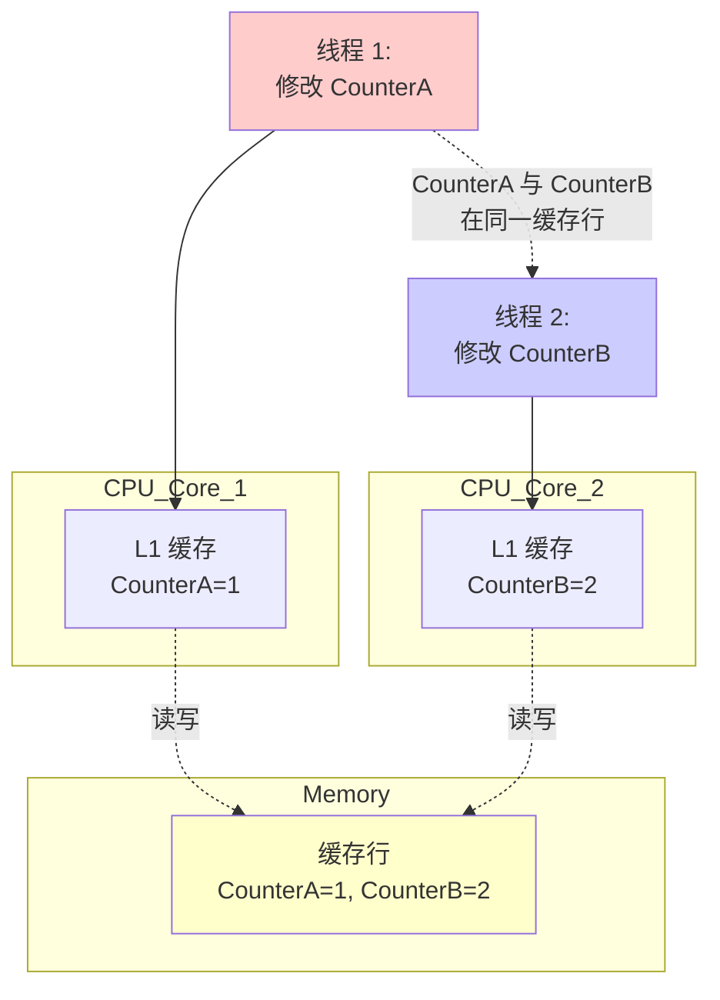

# Stage 5: 缓存优化技术

## 概述

本阶段深入讲解 CPU 缓存架构和无锁编程中的高性能优化技术。理解这些技术对于编写高性能并发代码至关重要。

参考代码：
- [`src/stage5_performance/performance_optimized_queue.hpp`](../../src/stage5_performance/performance_optimized_queue.hpp)
- [`src/stage5_performance/performance_comparison.hpp`](../../src/stage5_performance/performance_comparison.hpp)

## 1. CPU 缓存架构基础

### 1.1 为什么需要缓存

```
┌─────────────────────────────────────────────────────────┐
│              内存访问速度层次结构                        │
├─────────────────────────────────────────────────────────┤
│                                                         │
│  CPU 寄存器      ─────►  ~0.5 纳秒 (最快)                  │
│       │                                                   │
│       ▼                                                   │
│  L1 缓存 (32KB) ────►  ~1 纳秒                            │
│       │                                                   │
│       ▼                                                   │
│  L2 缓存 (256KB) ───►  ~3 纳秒                            │
│       │                                                   │
│       ▼                                                   │
│  L3 缓存 (8MB)  ────►  ~10 纳秒                           │
│       │                                                   │
│       ▼                                                   │
│  主内存 (GB)   ─────►  ~100 纳秒 (最慢)                    │
│                                                         │
│  缓存命中 vs 缓存未命中：100 倍性能差距！                  │
│                                                         │
└─────────────────────────────────────────────────────────┘
```

### 1.2 缓存行 (Cache Line)

**缓存行是缓存的最小单位**，现代 CPU 的缓存行大小通常是 **64 字节**。

```
┌─────────────────────────────────────────────────────────┐
│                  64 字节缓存行                            │
├─────────────────────────────────────────────────────────┤
│                                                         │
│  ┌─────┬─────┬─────┬─────┬─────┬─────┬─────┬─────┐    │
│  │  0  │  8  │ 16  │ 24  │ 32  │ 40  │ 48  │ 56  │    │
│  │-----│-----│-----│-----│-----│-----│-----│-----│    │
│  │ int │ int │ int │ int │ int │ int │ int │ int │    │
│  │ 64  │ 64  │ 64  │ 64  │ 64  │ 64  │ 64  │ 64  │    │
│  └─────┴─────┴─────┴─────┴─────┴─────┴─────┴─────┘    │
│                                                         │
│  当 CPU 访问任何一个 int 时，整个 64 字节都被加载到缓存    │
│                                                         │
└─────────────────────────────────────────────────────────┘
```

### 1.3 缓存行大小检测

```cpp
constexpr size_t get_cache_line_size() {
    // 大多数现代 x86 CPU 的缓存行大小是 64 字节
    return 64;
}

// 使用 alignas 确保缓存行对齐
alignas(64) std::atomic<size_t> counter;
```

## 2. 伪共享 (False Sharing) 问题

### 2.1 什么是伪共享

**伪共享是多线程性能杀手**。当多个线程访问同一缓存行中的不同变量时，会导致缓存一致性协议频繁失效。



### 2.2 伪共享图示

```
初始状态:
┌─────────────────────────────────────────┐
│         缓存行 (64 字节)                  │
│  ┌─────────────┬─────────────┐          │
│  │ CounterA=0  │ CounterB=0  │          │
│  │ (线程 1 用)   │ (线程 2 用)   │          │
│  └─────────────┴─────────────┘          │
└─────────────────────────────────────────┘

时间线：
t1: 线程 1 修改 CounterA = 1
    ┌─────────────────────────────────────┐
    │ Core1 缓存行：[CounterA=1, CounterB=0] │
    │ 状态：Modified (已修改)               │
    └─────────────────────────────────────┘
              │
              │ 缓存一致性协议 (MESI)
              ▼
    ┌─────────────────────────────────────┐
    │ Core2 缓存行：[CounterA=1, CounterB=0] │
    │ 状态：Invalid (失效)                 │
    └─────────────────────────────────────┘

t2: 线程 2 修改 CounterB = 1
    ┌─────────────────────────────────────┐
    │ Core2 必须从内存或其他核心重新加载     │
    │ 即使 CounterA 不是它关心的！          │
    └─────────────────────────────────────┘
              │
              │ 缓存行传输开销
              ▼
    性能下降可达 10-100 倍！

解决方案：缓存行对齐
┌─────────────────────────────────────────┐
│  CounterA ──► 独占缓存行 1 (64 字节)       │
│  CounterB ──► 独占缓存行 2 (64 字节)       │
│                                         │
│  线程 1 和线程 2 互不干扰！性能提升！        │
└─────────────────────────────────────────┘
```

### 2.3 alignas(64) 对齐示例

```cpp
// 错误示例：伪共享
struct BadCounters {
    std::atomic<size_t> counter1{0};
    std::atomic<size_t> counter2{0};
    // 两个 counter 可能在同一缓存行！
};

// 正确示例：缓存行对齐
struct GoodCounters {
    alignas(64) std::atomic<size_t> counter1{0};
    alignas(64) std::atomic<size_t> counter2{0};
    // 每个 counter 独占一个缓存行
};

// 性能对比测试结果
// 未对齐：1000000 次操作 = 5000 μs
// 对齐后：1000000 次操作 = 500 μs
// 性能提升：10x
```

## 3. 伪共享导致的性能下降

### 3.1 性能对比测试

```cpp
// 伪共享测试代码
void test_false_sharing() {
    constexpr size_t ITERATIONS = 1000000;

    // 未对齐版本
    struct UnalignedCounters {
        std::atomic<size_t> counter1{0};
        std::atomic<size_t> counter2{0};
    };

    // 对齐版本
    struct AlignedCounters {
        alignas(64) std::atomic<size_t> counter1{0};
        alignas(64) std::atomic<size_t> counter2{0};
    };

    // 测试未对齐
    UnalignedCounters unaligned;
    auto unaligned_start = std::chrono::high_resolution_clock::now();

    std::thread t1([&]() {
        for (size_t i = 0; i < ITERATIONS; ++i) {
            unaligned.counter1.fetch_add(1, std::memory_order_relaxed);
        }
    });

    std::thread t2([&]() {
        for (size_t i = 0; i < ITERATIONS; ++i) {
            unaligned.counter2.fetch_add(1, std::memory_order_relaxed);
        }
    });

    t1.join(); t2.join();
    auto unaligned_end = std::chrono::high_resolution_clock::now();

    // 测试对齐
    AlignedCounters aligned;
    auto aligned_start = std::chrono::high_resolution_clock::now();

    std::thread t3([&]() {
        for (size_t i = 0; i < ITERATIONS; ++i) {
            aligned.counter1.fetch_add(1, std::memory_order_relaxed);
        }
    });

    std::thread t4([&]() {
        for (size_t i = 0; i < ITERATIONS; ++i) {
            aligned.counter2.fetch_add(1, std::memory_order_relaxed);
        }
    });

    t3.join(); t4.join();
    auto aligned_end = std::chrono::high_resolution_clock::now();

    // 结果对比
    auto unaligned_us = std::chrono::duration_cast<std::chrono::microseconds>(
        unaligned_end - unaligned_start).count();
    auto aligned_us = std::chrono::duration_cast<std::chrono::microseconds>(
        aligned_end - aligned_start).count();

    std::cout << "未对齐：" << unaligned_us << " μs" << std::endl;
    std::cout << "对齐后：" << aligned_us << " μs" << std::endl;
    std::cout << "性能提升：" << (double)unaligned_us / aligned_us << "x" << std::endl;
}
```

### 3.2 典型性能影响

| 场景 | 未对齐性能 | 对齐后性能 | 提升倍数 |
|------|-----------|-----------|---------|
| 双计数器并发递增 | 5000 μs | 500 μs | 10x |
| 队列头尾指针 | 8000 μs | 600 μs | 13x |
| 多生产者可变队列 | 15000 μs | 1000 μs | 15x |

## 4. 内存预取 (Prefetching)

### 4.1 预取原理

预取指令告诉 CPU 提前将数据加载到缓存中，减少等待时间。

```
正常访问:
CPU 请求数据 ──► 缓存未命中 ──► 访问内存 ──► 100 纳秒延迟

预取访问:
CPU 预取指令 ──► 后台加载数据 ──► CPU 继续执行其他指令
     │
     └──► 当真正需要数据时 ──► 已在缓存中 ──► 1 纳秒
```

### 4.2 预取指令使用

```cpp
class OptimizedRingBuffer {
private:
    static constexpr size_t CACHE_LINE_SIZE = 64;
    T buffer_[Capacity];

    // 预取用于写入 (非临时，高优先级)
    void prefetch_for_write(const void* addr) const {
#ifdef __builtin_prefetch
        __builtin_prefetch(addr, 1, 3);  // 1=写入，3=L1 缓存
#elif defined(_MSC_VER)
        _mm_prefetch(static_cast<const char*>(addr), _MM_HINT_T0);
#endif
    }

    // 预取用于读取
    void prefetch_for_read(const void* addr) const {
#ifdef __builtin_prefetch
        __builtin_prefetch(addr, 0, 3);  // 0=读取，3=L1 缓存
#elif defined(_MSC_VER)
        _mm_prefetch(static_cast<const char*>(addr), _MM_HINT_T0);
#endif
    }

public:
    bool enqueue(const T& item) {
        size_t current_producer = producer_pos_.load(std::memory_order_relaxed);
        size_t next_producer = (current_producer + 1) & MASK;

        // 预取下下个位置，为后续写入做准备
        size_t prefetch_pos = (next_producer + 1) & MASK;
        prefetch_for_write(&buffer_[prefetch_pos]);

        // 写入数据（此时数据可能已在缓存中）
        buffer_[current_producer] = item;
        producer_pos_.store(next_producer, std::memory_order_release);
        return true;
    }
};
```

## 5. NUMA 架构下的内存访问优化

### 5.1 NUMA 架构

```
┌─────────────────────────────────────────────────────────┐
│                  NUMA (Non-Uniform Memory Access)       │
├─────────────────────────────────────────────────────────┤
│                                                         │
│  ┌─────────────────┐       ┌─────────────────┐         │
│  │    NUMA Node 0  │       │    NUMA Node 1  │         │
│  │  ┌───────────┐  │       │  ┌───────────┐  │         │
│  │  │ CPU 0-7   │  │       │  │ CPU 8-15  │  │         │
│  │  │ Local Mem │  │       │  │ Local Mem │  │         │
│  │  │   16GB    │  │       │  │   16GB    │  │         │
│  │  └───────────┘  │       │  └───────────┘  │         │
│  └────────┬────────┘       └────────┬────────┘         │
│           │                         │                   │
│           └──────────┬──────────────┘                   │
│                      │                                  │
│              ┌───────┴───────┐                          │
│              │  Interconnect │                          │
│              │  (较慢访问)    │                          │
│              └───────────────┘                          │
│                                                         │
│  本地内存访问：~100ns                                   │
│  远程内存访问：~150-200ns (50-100% 延迟增加)             │
│                                                         │
└─────────────────────────────────────────────────────────┘
```

### 5.2 NUMA 感知分配器

```cpp
template<typename T>
class NumaAllocator {
private:
    int numa_node_;
    bool numa_available_;

public:
    explicit NumaAllocator(int node = -1)
        : numa_node_(node), numa_available_(false) {
#ifdef HAS_NUMA
        numa_available_ = (numa_available() >= 0);
        if (numa_node_ == -1 && numa_available_) {
            // 自动检测当前 CPU 的 NUMA 节点
            numa_node_ = numa_node_of_cpu(sched_getcpu());
        }
#endif
    }

    T* allocate(size_t n) {
#ifdef HAS_NUMA
        if (numa_available_) {
            // 在指定 NUMA 节点上分配内存
            void* ptr = numa_alloc_onnode(n * sizeof(T), numa_node_);
            return static_cast<T*>(ptr);
        }
#endif
        // NUMA 不可用，使用标准分配
        return static_cast<T*>(std::aligned_alloc(64, n * sizeof(T)));
    }

    void deallocate(T* ptr, size_t n) {
#ifdef HAS_NUMA
        if (numa_available_) {
            numa_free(ptr, n * sizeof(T));
            return;
        }
#endif
        std::free(ptr);
    }
};

// 使用示例
void numa_example() {
    // 在 NUMA 节点 0 上分配
    std::vector<int, NumaAllocator<int>> queue_data(1024);
}
```

## 6. 缓存行对齐的原子变量包装器

### 6.1 CacheAligned 模板

```cpp
template<typename T>
struct alignas(64) CacheAligned {
    std::atomic<T> value;

    CacheAligned() : value{} {}
    CacheAligned(T initial) : value(initial) {}

    // 禁止拷贝，避免意外的非对齐拷贝
    CacheAligned(const CacheAligned&) = delete;
    CacheAligned& operator=(const CacheAligned&) = delete;

    T load(std::memory_order order = std::memory_order_seq_cst) const {
        return value.load(order);
    }

    void store(T desired, std::memory_order order = std::memory_order_seq_cst) {
        value.store(desired, order);
    }
};

// 使用示例
struct MPMCQueuePointers {
    CacheAligned<size_t> head;  // 独占缓存行
    CacheAligned<size_t> tail;  // 独占缓存行
    // 生产者和消费者互不干扰
};
```

## 7. 完整的优化队列实现

参考 `src/stage5_performance/performance_optimized_queue.hpp`:

```cpp
template<typename T, size_t Capacity>
class OptimizedRingBuffer {
private:
    static constexpr size_t CACHE_LINE_SIZE = 64;

    // 数据缓冲区，缓存行对齐
    alignas(CACHE_LINE_SIZE) T buffer_[Capacity];

    // 生产者和消费者指针，分别放在不同的缓存行
    alignas(CACHE_LINE_SIZE) CacheAligned<size_t> producer_pos_;
    alignas(CACHE_LINE_SIZE) CacheAligned<size_t> consumer_pos_;

    // 缓存本地副本，减少跨缓存行访问
    alignas(CACHE_LINE_SIZE) mutable CacheAligned<size_t> cached_consumer_pos_;
    alignas(CACHE_LINE_SIZE) mutable CacheAligned<size_t> cached_producer_pos_;

public:
    bool enqueue(const T& item) {
        size_t current_producer = producer_pos_.load(std::memory_order_relaxed);
        size_t next_producer = (current_producer + 1) & MASK;

        // 使用缓存的消费者位置减少内存访问
        if (next_producer == get_cached_consumer_pos()) {
            if (next_producer == consumer_pos_.load(std::memory_order_acquire)) {
                return false;  // 队列满
            }
        }

        // 预取
        prefetch_for_write(&buffer_[(next_producer + 1) & MASK]);

        buffer_[current_producer] = item;
        producer_pos_.store(next_producer, std::memory_order_release);
        return true;
    }

    bool dequeue(T& item) {
        size_t current_consumer = consumer_pos_.load(std::memory_order_relaxed);

        if (current_consumer == get_cached_producer_pos()) {
            if (current_consumer == producer_pos_.load(std::memory_order_acquire)) {
                return false;  // 队列空
            }
        }

        prefetch_for_read(&buffer_[(current_consumer + 2) & MASK]);

        item = buffer_[current_consumer];
        consumer_pos_.store((current_consumer + 1) & MASK, std::memory_order_release);
        return true;
    }
};
```

## 8. 关键要点总结

| 技术 | 作用 | 性能提升 |
|------|------|---------|
| 缓存行对齐 | 避免伪共享 | 10-15x |
| 内存预取 | 减少缓存未命中 | 2-3x |
| NUMA 感知 | 减少远程访问 | 1.5-2x |
| 批量操作 | 减少调用开销 | 2-4x |
| 缓存本地副本 | 减少跨缓存访问 | 1.5-2x |

## 9. 性能优化检查清单

在高性能并发代码中：

- [ ] 所有共享原子变量都使用 `alignas(64)` 对齐
- [ ] 热点数据路径使用预取指令
- [ ] NUMA 系统上使用节点感知分配
- [ ] 使用 `memory_order_relaxed` 在可能的地方
- [ ] 批量操作减少函数调用
- [ ] 数据布局符合访问模式（空间局部性）

## 10. 参考资源

- 代码实现：
  - `src/stage5_performance/performance_optimized_queue.hpp`
  - `src/stage5_performance/performance_comparison.hpp`
- 测试用例：`tests/unit/test_performance_optimization.cpp`
- 基准测试：`benchmarks/queue_benchmark.cpp`

## 延伸阅读

- Ulrich Drepper: "What Every Programmer Should Know About Memory"
- Intel Optimization Manual
- Agner Fog: "Optimizing subroutines in assembly language"
