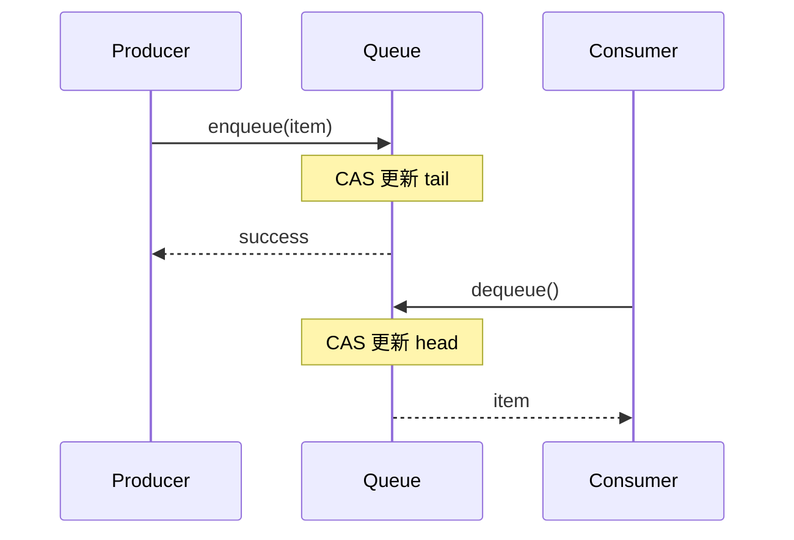

# PRD: 队列原理解读与性能对比增强计划

## 1. 引言/概述

本项目已具备完整的队列实现（从互斥锁队列到无锁队列、分布式队列），但现有的原理分析和性能对比报告深度不足。本 PRD 旨在规划如何增强项目的**原理解读**和**性能对比分析**，使其成为一个由浅入深、理论与实践并重的完整学习资源。

### 当前问题

1. **原理分析不够深入**: 现有文档对核心概念（如内存序、ABA 问题、SMR）的解释较浅
2. **性能对比维度单一**: 主要关注延迟和吞吐，缺少 CPU 利用率、内存占用、扩展性等维度
3. **缺乏与业界方案对比**: 没有与 Kafka、LMAX Disruptor 等业界知名队列/日志系统进行对比
4. **可视化不足**: 缺少图表、流程图、时序图等直观展示
5. **缺少场景化分析**: 没有针对不同应用场景给出选型建议

---

## 2. 目标

- [ ] **目标 1**: 增强原理解读深度，覆盖从基础到高级的所有核心概念
- [ ] **目标 2**: 扩展性能对比维度，包含 CPU、内存、扩展性等多维度分析
- [ ] **目标 3**: 增加与业界方案（Kafka、LMAX Disruptor）的对比
- [ ] **目标 4**: 添加丰富的可视化图表和时序图
- [ ] **目标 5**: 提供场景化的选型指南和最佳实践建议

---

## 3. 用户故事

### US-001: 深入原理解读 - 内存模型与原子操作

**描述:** 作为一名**并发编程初学者**，我希望**理解 C++ 内存模型和原子操作的原理**，以便**能够正确编写无锁代码**。

**验收标准:**
- [ ] 详细解释 5 种内存序 (relaxed/acquire/release/acq_rel/seq_cst) 的语义
- [ ] 提供每种内存序的代码示例和反例
- [ ] 使用时序图展示不同内存序下线程间的可见性
- [ ] 解释 CPU 重排序和编译器重排序的区别
- [ ] 提供内存屏障 (memory barrier) 的使用示例

---

### US-002: 深入原理解读 - ABA 问题与解决方案

**描述:** 作为一名**中级开发者**，我希望**深入理解 ABA 问题的成因和多种解决方案**，以便**能够在实际项目中正确选择和实现 SMR 机制**。

**验收标准:**
- [ ] 使用图示和代码演示 ABA 问题的形成过程
- [ ] 对比三种解决方案：标记指针、版本号、Hazard Pointers
- [ ] 提供可复现 ABA 问题的测试代码
- [ ] 分析各方案的内存开销和性能影响
- [ ] 解释为什么简单的 CAS 无法解决 ABA 问题

---

### US-003: 深入原理解读 - 安全内存回收 (SMR)

**描述:** 作为一名**高级开发者**，我希望**理解 Hazard Pointers 和 Epoch-based Reclamation 的原理与实现**，以便**能够为无锁数据结构选择合适的内存回收策略**。

**验收标准:**
- [ ] 详细解释 Hazard Pointer 的声明、验证、回收流程
- [ ] 详细解释 Epoch-based 的全局纪元、线程状态、回收条件
- [ ] 对比两种 SMR 方案的优缺点 (延迟、吞吐、内存占用)
- [ ] 提供伪代码和流程图展示核心算法
- [ ] 分析 SMR 对性能的影响数据

---

### US-004: 深入原理解读 - 缓存优化技术

**描述:** 作为一名**性能优化工程师**，我希望**理解伪共享、缓存行对齐、NUMA 感知等优化技术**，以便**能够针对特定硬件进行性能调优**。

**验收标准:**
- [ ] 解释 CPU 缓存架构和缓存行概念
- [ ] 使用图示展示伪共享如何导致性能下降
- [ ] 提供 `alignas(64)` 等对齐技术的示例
- [ ] 对比优化前后的性能数据 (使用 perf 等工具分析)
- [ ] 解释 NUMA 架构下的内存访问优化策略

---

### US-005: 性能对比 - 多维度基准测试

**描述:** 作为一名**系统架构师**，我希望**获得全面的性能对比数据**，以便**为项目选择合适的队列实现**。

**验收标准:**
- [ ] 延迟指标：avg/p50/p95/p99/p99.9/标准差
- [ ] 吞吐指标：ops/s、bytes/s (不同消息大小)
- [ ] CPU 利用率：不同并发度下的 CPU 消耗
- [ ] 内存占用：静态内存 + 动态分配 + SMR 开销
- [ ] 扩展性：随核心数增加的吞吐变化曲线
- [ ] 公平性：各线程操作延迟的分布对比

---

### US-006: 性能对比 - 与业界方案对比

**描述:** 作为一名**技术选型负责人**，我希望**看到本项目实现与 Kafka、LMAX Disruptor 等业界方案的对比**，以便**评估自研方案的性能水平**。

**验收标准:**
- [ ] 对比 LMAX Disruptor (RingBuffer 实现)
- [ ] 对比 Kafka (日志结构化队列)
- [ ] 对比 boost::lockfree::queue
- [ ] 对比 moodycamel::ConcurrentQueue
- [ ] 在相同硬件和负载下的公平对比
- [ ] 分析各方案的优缺点和适用场景

---

### US-007: 可视化增强 - 原理图解

**描述:** 作为一名**视觉学习者**，我希望**看到丰富的流程图、时序图和架构图**，以便**更直观地理解复杂的并发流程**。

**验收标准:**
- [ ] 为每个队列实现绘制架构图
- [ ] 为 enqueue/dequeue 操作绘制时序图
- [ ] 为 SMR 机制绘制状态转换图
- [ ] 使用 Mermaid 或 Graphviz 生成可渲染的图表
- [ ] 在 Markdown 文档中嵌入图表

---

### US-008: 场景化选型指南

**描述:** 作为一名**应用开发者**，我希望**获得针对不同场景的选型建议**，以便**快速选择最适合的队列实现**。

**验收标准:**
- [ ] 低延迟场景 (高频交易) 的选型建议
- [ ] 高吞吐场景 (日志收集) 的选型建议
- [ ] 资源受限场景 (嵌入式) 的选型建议
- [ ] 分布式场景 (跨节点通信) 的选型建议
- [ ] 提供决策树或选择流程图

---

## 4. 功能需求

### FR-1: 原理文档增强

| 需求 ID | 描述 | 优先级 |
|---------|------|--------|
| FR-1.1 | 为每个 stage 创建对应的原理文档 `docs/principles/stageX.md` | P0 |
| FR-1.2 | 文档必须包含核心概念解释、伪代码、流程图 | P0 |
| FR-1.3 | 提供代码示例链接到对应的源码文件 | P1 |
| FR-1.4 | 使用 Mermaid 语法绘制时序图和流程图 | P1 |
| FR-1.5 | 添加"常见误区"章节，解释易错点 | P2 |

### FR-2: 基准测试增强

| 需求 ID | 描述 | 优先级 |
|---------|------|--------|
| FR-2.1 | 增加 CPU 利用率测量 (使用 perf 或 clock_gettime) | P0 |
| FR-2.2 | 增加内存占用测量 (使用 mallinfo 或 /proc/self/status) | P0 |
| FR-2.3 | 增加扩展性测试 (1/2/4/8 消费者对比) | P0 |
| FR-2.4 | 增加不同消息大小的测试 (8B/64B/256B/1KB) | P1 |
| FR-2.5 | 增加延迟百分位统计 (p99.9) | P1 |
| FR-2.6 | 增加公平性测试 (各线程延迟分布) | P2 |

### FR-3: 业界方案对比

| 需求 ID | 描述 | 优先级 |
|---------|------|--------|
| FR-3.1 | 集成 LMAX Disruptor (C++ 移植版或类似实现) | P1 |
| FR-3.2 | 集成 moodycamel::ConcurrentQueue 对比 | P1 |
| FR-3.3 | 创建统一的 benchmark 接口，支持多种队列 | P0 |
| FR-3.4 | 生成对比报告 `docs/BENCHMARK_COMPARISON.md` | P0 |

### FR-4: 可视化与报告

| 需求 ID | 描述 | 优先级 |
|---------|------|--------|
| FR-4.1 | 使用 Python 脚本生成性能对比图表 (matplotlib) | P0 |
| FR-4.2 | 生成 SVG/PNG 图表保存到 `docs/images/` | P0 |
| FR-4.3 | 更新 `docs/BENCHMARK_REPORT.md` 包含新图表 | P0 |
| FR-4.4 | 创建选型决策树 `docs/SELECTION_GUIDE.md` | P1 |

---

## 5. 非目标 (Out of Scope)

- [ ] 实现新的队列算法 (聚焦于分析现有实现)
- [ ] 支持 Windows 平台 (仅针对 Linux)
- [ ] 真实的 Kafka/RabbitMQ 集成 (仅模拟或对比)
- [ ] GUI 可视化工具 (使用静态图表)
- [ ] 自动化性能调优建议

---

## 6. 设计考虑

### 6.1 文档结构

```
docs/
├── principles/                 # 原理文档
│   ├── stage1_mutex.md        # 互斥锁与条件变量
│   ├── stage2_spsc.md         # SPSC 与内存序
│   ├── stage3_mpmc.md         # MPMC 与 ABA 问题
│   ├── stage4_smr.md          # 安全内存回收
│   ├── stage5_cache.md        # 缓存优化技术
│   ├── stage6_cpp23.md        # C++23 特性
│   └── stage7_distributed.md  # 分布式队列
│
├── benchmarks/                 # 基准测试报告
│   ├── BENCHMARK_REPORT.md    # 主报告 (增强版)
│   ├── BENCHMARK_COMPARISON.md # 业界对比
│   └── images/                # 生成的图表
│
└── guides/                     # 指南
    ├── SELECTION_GUIDE.md     # 选型指南
    └── BEST_PRACTICES.md      # 最佳实践
```

### 6.2 图表规范

- 使用 **Mermaid** 绘制时序图和流程图 (GitHub 原生支持)
- 使用 **matplotlib** 生成性能对比图
- 使用 **Graphviz** 绘制状态机图
- 所有图表提供文字描述 (无障碍访问)

### 6.3 基准测试规范

- 每次运行至少 5 次重复 (REPEATS=5)
- 报告 mean ± std
- 预热阶段至少 1000 次操作
- 使用 CLOCK_MONOTONIC 纳秒级计时
- 记录完整的硬件和 OS 信息

---

## 7. 技术考虑

### 7.1 性能测量工具

| 工具 | 用途 |
|------|------|
| `clock_gettime(CLOCK_MONOTONIC)` | 纳秒级计时 |
| `perf stat` | CPU 事件统计 |
| `/proc/self/status` | 内存占用 |
| `pthread_getaffinity_np` | 线程绑核 |
| Google Benchmark | 微基准测试 |

### 7.2 图表生成

```python
# 使用 matplotlib 生成图表
import matplotlib.pyplot as plt
import pandas as pd

# 读取 CSV 数据
df = pd.read_csv('results/summary.csv')

# 生成对比图
plt.figure(figsize=(12, 6))
# ... 绘图逻辑
plt.savefig('docs/images/throughput_comparison.png')
```

### 7.3 Mermaid 示例



---

## 8. 成功指标

| 指标 | 目标值 |
|------|--------|
| 原理文档覆盖率 | 100% (每个 stage 都有对应文档) |
| 性能维度数量 | ≥6 个 (延迟/吞吐/CPU/内存/扩展性/公平性) |
| 图表数量 | ≥15 个 (架构图/时序图/性能图) |
| 业界对比方案 | ≥3 个 (Disruptor/moodycamel/Boost) |
| 文档可读性 | 初学者能理解 50%+ 内容 |

---

## 9. 开放问题

| 问题 | 说明 |
|------|------|
| Q1: 是否需要实现真实的 Kafka 客户端？ | 当前只有模拟实现，是否需要集成 librdkafka？ |
| Q2: 是否需要支持 ARM 架构测试？ | 当前仅 x86_64，是否需要 ARM64 对比数据？ |
| Q3: 是否需要动态网页展示？ | 当前为静态 Markdown，是否需要生成 HTML 报告？ |
| Q4: 是否需要对齐更多队列实现？ | 如 C++23 的 `std::atomic_wait/notify_one`？ |

---

## 10. 实施计划

### Phase 1: 原理文档增强 (P0)
- [ ] 创建 `docs/principles/` 目录结构
- [ ] 编写 stage1-3 的原理文档
- [ ] 为每个文档添加 Mermaid 图表
- [ ] 添加代码示例链接

### Phase 2: 基准测试增强 (P0)
- [ ] 实现 CPU 利用率测量
- [ ] 实现内存占用测量
- [ ] 扩展扩展性测试
- [ ] 更新 benchmark 脚本

### Phase 3: 图表生成 (P1)
- [ ] 编写 Python 图表生成脚本
- [ ] 生成性能对比图
- [ ] 更新 BENCHMARK_REPORT.md

### Phase 4: 业界对比 (P1)
- [ ] 集成 moodycamel::ConcurrentQueue
- [ ] 创建统一 benchmark 接口
- [ ] 生成对比报告

### Phase 5: 选型指南 (P2)
- [ ] 编写 SELECTION_GUIDE.md
- [ ] 创建决策树图表
- [ ] 编写 BEST_PRACTICES.md

---

## 附录 A: 现有资源评估

### 现有文档
| 文档 | 状态 | 需改进 |
|------|------|--------|
| README.md | ✅ 完整 | 增加原理深度 |
| guide.md | ✅ 完整 | 增加图表 |
| BENCHMARK_REPORT.md | ⚠️ 基础 | 增加维度和对比 |
| 1.report.md | ⚠️ 基础 | 整合到 docs/ |

### 现有代码
| 模块 | 状态 | 需改进 |
|------|------|--------|
| stage1_basics | ✅ 完整 | - |
| stage2_spsc | ✅ 完整 | - |
| stage3_mpmc | ✅ 完整 | - |
| stage4_smr | ✅ 完整 | - |
| stage5_performance | ✅ 完整 | - |
| stage6_cpp23 | ✅ 完整 | - |
| stage7_distributed | ✅ 完整 | 增加真实客户端 |
| benchmarks | ⚠️ 基础 | 增加测量维度 |

---

## 附录 B: 参考资料

### 书籍
- 《C++ Concurrency in Action》- Anthony Williams
- 《Effective Concurrency》- Herb Sutter

### 论文
- Michael & Scott: "Simple, Fast, and Practical Non-Blocking and Blocking Concurrent Queue Algorithms" (1996)
- Fraser: "Practical Lock-Freedom" (2004) - Hazard Pointers
- Harris & Fraser: "Practical Lock-Free Data Structures" (2002)

### 开源项目
- [LMAX Disruptor](https://lmax-exchange.github.io/disruptor/)
- [moodycamel::ConcurrentQueue](https://github.com/cameron314/concurrentqueue)
- [libcds](https://github.com/khizmax/libcds)

### 在线资源
- Jeff Preshing's Blog: "Memory Reordering Caught in the Act"
-CppCon Talks on Lock-Free Programming
